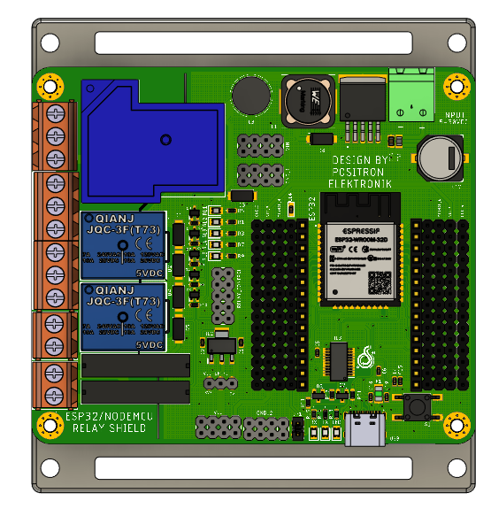
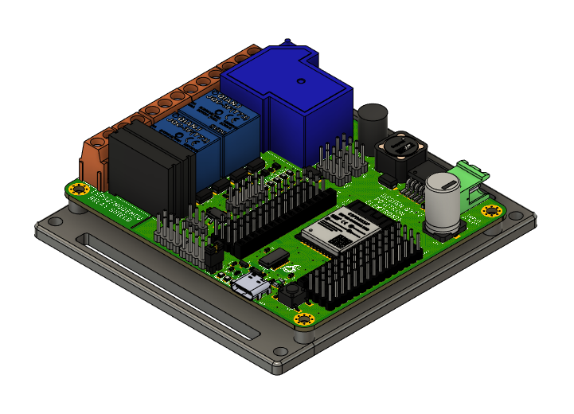
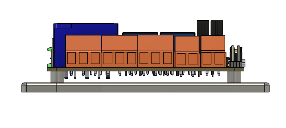
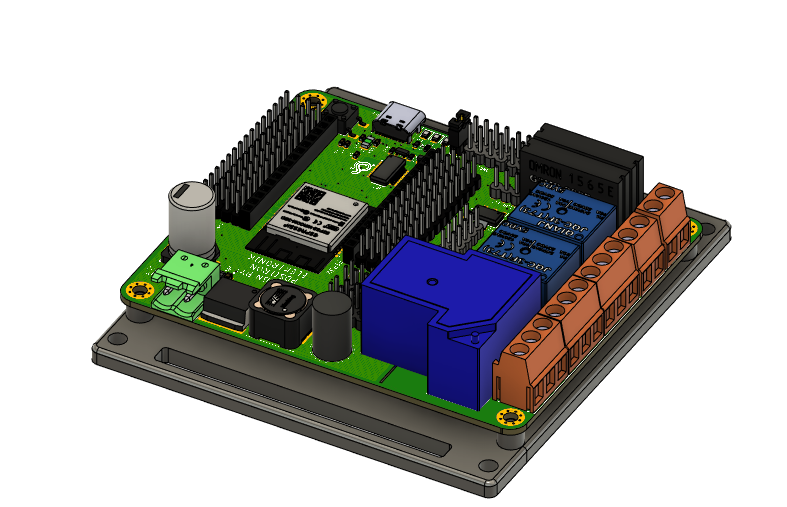
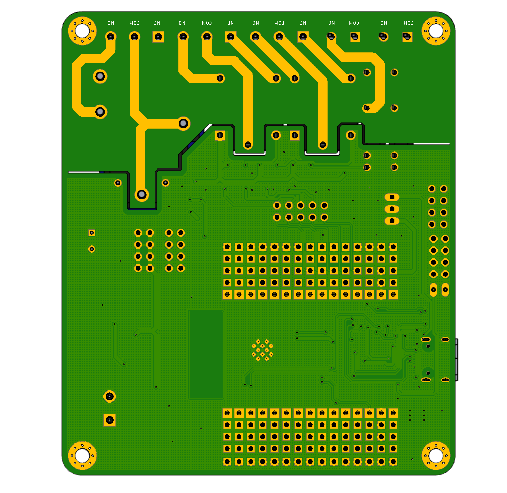

# ShieldRelay_ESP32
Relay Shield for ESP32 , Nodemcu V2 Amica or Nodemcu V3 Lolin. In board there are 5 Relay and 3 type of Relay, first is 30A Relay Coil, second is 10 A Relay Coil and third is SSR 2A. And there are full extend header of Microcontroller. the power using Stepdown LM2596 with output 5V 3A and Input 5-30VDC. 

## Spesification ShieldRelay_ESP32
- Input Power 5-30VDC and stepdown to 5VDC
- PTC Fuse
- INPUT HEADER
- VCC HEADER
- VCC Selector 3v3 or 5V
- Supported ESP32 DEV KIT, NODEMCU V2 or V3
- Pin Header GPIO with Servo Formated
- 1 x 30A Relay Coil
- 2 x 10A Relay Couil
- 2 x 2A SSR

# Privew Hardware BASE RPI

  
  
  
  
  

# Documentation 
- [Dimension](https://github.com/juarendra/ShieldRelay_ESP32/blob/main/HARDWARE/dimension_shield_esp32.pdf)
- [BOM](https://github.com/juarendra/ShieldRelay_ESP32/blob/main/DOC/BOM_shieldRelay.csv)

